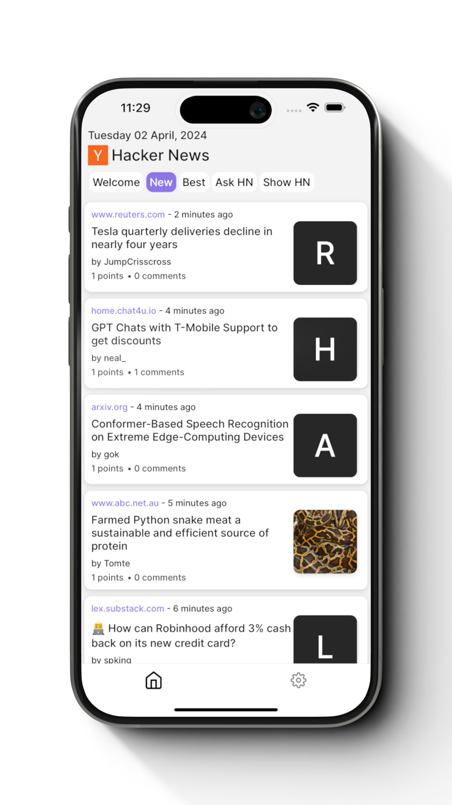

# HNews

Fully open source hacker news client for both iOS and Android.

## Release Status

### Apple

Apple did not like this app, claiming it was not different enough from a webpage ([others](https://forums.developer.apple.com/forums/thread/95085) have had similar issues).

But you can download the app via TestFlight [here](https://testflight.apple.com/join/DjtQPqho)

### Google

Use [this](https://play.google.com/apps/internaltest/4700382531060013255) link to download it.

## Known Bugs

- Large posts not always rendering upvote/unvote fields

Found a bug? Please report it under `issues`
